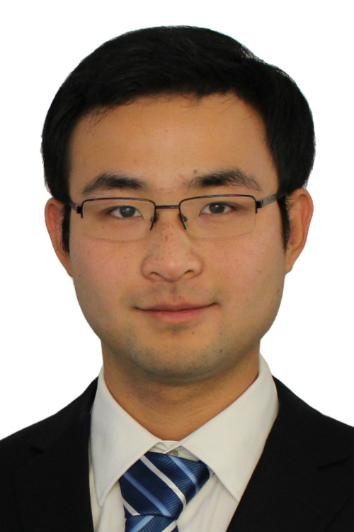

---
# You don't need to edit this file, it's empty on purpose.
# Edit theme's home layout instead if you wanna make some changes
# See: https://jekyllrb.com/docs/themes/#overriding-theme-defaults
layout: default
title: Home
---

<h1> Liu, Chang </h1>

	

		
	

	

		
 Hi! I am a Postdoctoral Associate at the School of Mechanical and Aerospace Engineering, Cornell University. I work with <a href="http://lisc.mae.cornell.edu/wordpress/?page_id=33">Silvia Ferrari</a>, <a href="https://campbell.mae.cornell.edu/research-group/mark-campbell">Mark Campbell</a>, and <a href="https://www.cs.cornell.edu/~kilian/">Killian Weinberger</a>. My current research focus is on decentralized perception, planning, and control of autonomous systems on both individual and large-scale levels for mission-critical situations. 

		
 I received my Ph.D. degree in Mechanical Engineering from the University of California, Berkeley in 2017. My advisors are <a href="http://www.me.berkeley.edu/j-karl-hedrick-professor-nonlinear-control-expert-1944-2017">J. Karl Hedrick</a> and <a href="https://www.me.berkeley.edu/people/faculty/francesco-borrelli">Francesco Borrelli</a>. My research was focused on the planning and estimation of robotic systems to make them work in complex environments and collaborate with humans in a safe and human-centric way. 

		
 I obtained the B.S. in Electrical Engineering and B.S. in Applied Mathematics from Peking University, China, in 2011. I obtained the M.S. in Mechanical Engineering and M.S. in Computer Science in 2014 and 2016, both from UC Berkeley. 

	

